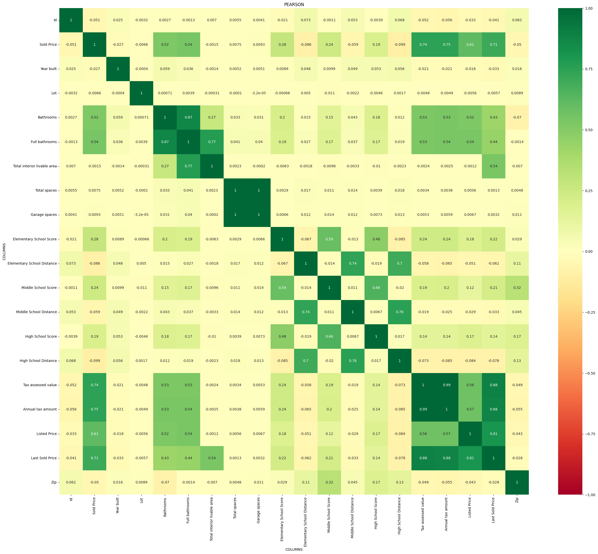
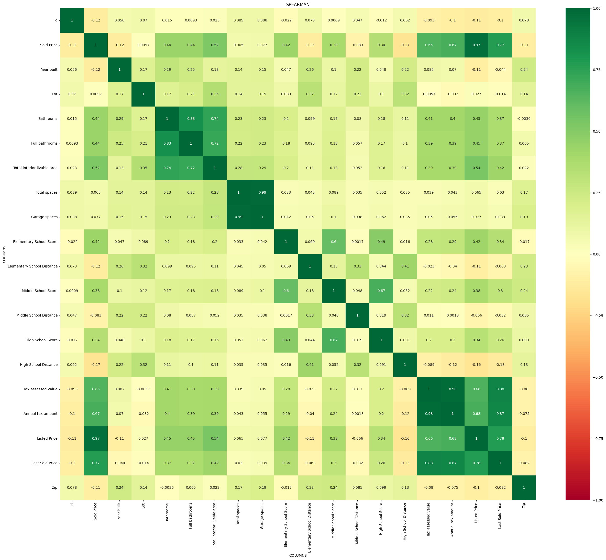

[李沐的Kaggle房价比赛](https://www.kaggle.com/competitions/california-house-prices)

# 2024.10.8


发现问题：
```
起初想按照加州的房价预测方法去做，发现特征处理有问题，原因是对于obj(字符串文本)特征直接进行`get_dummies`方法进行类别特征提取，但是会炸掉内存，原因是数据集特征太多，
```
解决方法：
```
对数字类特征num_features与文本类特征obj_features特征分别处理。
```
先进行相关性分析(皮尔森相关性分析 和 斯皮尔曼相关性分析)筛选出主要的特征，得出 数字特征相关性结论：

pearson相关性结果


spearman相关性结果


结论：

较强正相关性：`['Bathrooms', 'Full bathrooms', 'Tax assessed value', 'Annual tax amount', 'Listed Price', 'Last Sold Price']`

较强负相关性：`['Elementary School Distance','Middle School Distance', 'High School Distance']`
